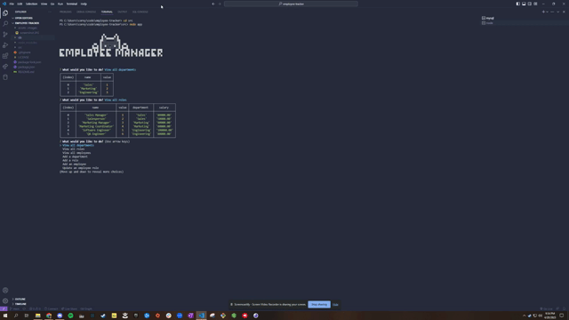

# Employee Manager


## Description

The Employee Manager CLI Application is a Node.js command-line interface designed to manage an employee database. The application allows the user to view, add, update, and delete departments, roles, and employees, as well as view employees by manager or department and view department budgets. The user is presented with a series of prompts to interact with the database and perform these actions.

## Table of Contents
- [Setting up the Database](#setting-up-the-database)
- [Running the Application](#running-the-application)
- [License](#license)
- [Contributing](#contributing)
- [Tests](#tests)
- [Questions](#questions)

## Setting up the Database
To install this application, follow these steps:

1. Clone the repository from GitHub
2. Download and install MySQL from the [official website](https://dev.mysql.com/downloads/mysql/) if you haven't already done so. 
Follow the instructions provided to set up MySQL on your local machine.
3. Download and install Node.js from the [official website](https://nodejs.org/en/download) if you haven't already done so.
 Follow the instructions provided to install Node.js on your local machine.
4. Open your terminal and navigate to the root directory of the application.
5. Install the required dependencies by running ```npm install```, this will install all the necessary packages and libraries required for the application to run.
6. Create a ```.env``` file in the root directory of the application by running the command ```touch .env```. This file will contain sensitive information such as passwords, so be sure to keep it secure.
7. In the .env file, add the following lines, replacing 'your_password' with the password for your MySQL login.
```
DB_HOST='localhost'
DB_USER='root'
DB_PASSWORD='your_password'
DB_NAME='employee_db'
``` 
8. Log in to the MySQL server by running the command ```mysql -u root -p``` and entering your password when prompted.
9. Create the database schema by running the command ```SOURCE db/schema.sql;```.
10. Seed the database with data by running the command ```SOURCE db/seeds.sql;```. 

*Please note that steps 8-10 should be performed in a separate terminal window or tab from the one running the Node.js application.*

## Running the Application
To use this application, please follow the steps below:

1. Open a terminal window and navigate to the ```src``` directory of the application.
2. Start the application by running ```node app.js```.
3. Choose an action from the main menu by using the arrow keys and pressing Enter.
4. Follow the prompts to perform the desired action.
5. To exit the application, select "Exit" from the main menu or press Ctrl + C.

For a short demonstration of the application, please refer to the [video](https://drive.google.com/file/d/1cnt5tiqcQcCrGN9lKpp_BA1Gg0pq9Bsu/view).



## Dependencies
This project requires the following dependencies:
- [inquirer](https://www.npmjs.com/package/inquirer)
- [mysql2](https://www.npmjs.com/package/mysql2)
- [console.table](https://www.npmjs.com/package/console.table)

## License

This project is licensed under the MIT license. Click [here](https://opensource.org/licenses/MIT) for more information.

## Contributing
To contribute to this project, please read the installation section and ensure you have a solid understanding of the codebase. Contributions are welcome via pull requests.

## Tests
Currently, there are no automated tests for this application. Testing is performed manually.

## Questions
If you have any questions, you can reach out to me on [GitHub](https://github.com/spamdalfz) or contact me directly at coreyvasser@gmail.com.
